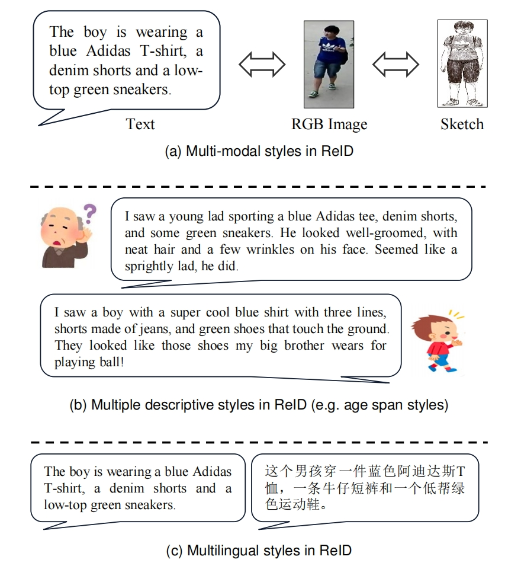

# StyleReID

## Dataset



### Statistics


### Access
Our dataset samples are available in the dataset directory. The samples are in JSON format and can be accessed as follows:

```javascript
import json
samples = json.load(open('dataset/en-samples-10.json', encoding='utf-8'))
